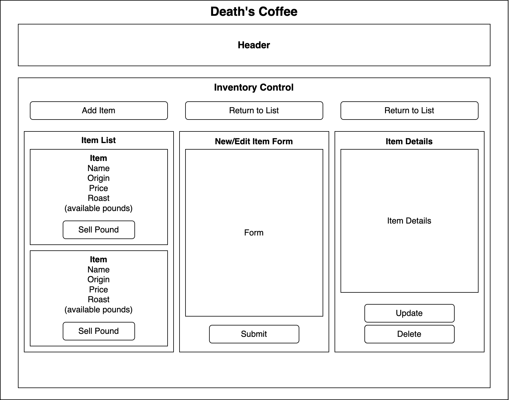

# _Death's Coffee_

#### By: _**David Gamble**_

#### _A React web app Epicodus project that demonstates full CRUD functionality._



## Technologies Used

* _HTML_
* _CSS_
* _JavaScript_
* _React_

## Description

_This is a web app for Death's Coffee that allows a user to add, edit, and delete inventory of coffee.  The site will display all inventory items and allow the user to sell one pound of coffee at a time until the invetory reaches zero._

## Setup/Installation Requirements

* _clone the repository to your desktop from:_
```
https://github.com/DavidDGamble/deaths-coffee.git
```
* _Enter the following commands in your terminal in the root repository deaths-coffee_
```
npm i
```
```
npm run build
```
```
npm run start
```

## Known Bugs

* _No known bugs_

## License

_Copyright (c) 2022 David Gamble_

_Permission is hereby granted, free of charge, to any person obtaining a copy of this software and associated documentation files (the "Software"), to deal in the Software without restriction, including without limitation the rights to use, copy, modify, merge, publish, distribute, sublicense, and/or sell copies of the Software, and to permit persons to whom the Software is furnished to do so, subject to the following conditions:_

_The above copyright notice and this permission notice shall be included in all copies or substantial portions of the Software._

_THE SOFTWARE IS PROVIDED "AS IS", WITHOUT WARRANTY OF ANY KIND, EXPRESS OR IMPLIED, INCLUDING BUT NOT LIMITED TO THE WARRANTIES OF MERCHANTABILITY, FITNESS FOR A PARTICULAR PURPOSE AND NONINFRINGEMENT. IN NO EVENT SHALL THE AUTHORS OR COPYRIGHT HOLDERS BE LIABLE FOR ANY CLAIM, DAMAGES OR OTHER LIABILITY, WHETHER IN AN ACTION OF CONTRACT, TORT OR OTHERWISE, ARISING FROM, OUT OF OR IN CONNECTION WITH THE SOFTWARE OR THE USE OR OTHER DEALINGS IN THE SOFTWARE._
